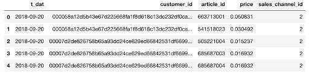
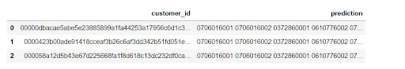
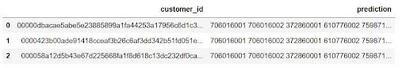

# H-M-Personalized-Fashion-Recommendations

**Kaggle competition: H&amp;M Personalized Fashion Recommendations.**

[Kaggle H&M](https://www.kaggle.com/c/h-and-m-personalized-fashion-recommendations)

A group educational final project as a part of Recommender Systems course.

## Authors

**Skoltech Data Science MSc students:** Evgeniy Garsiya, Lina Bashaeva, Evgeniy Frolov, Julia Orlova

## Abstract

The main goal of this project was to participate in H&M Personalized Fashion Recommendations competition, where participants competed to create a recommendation system that provides product recommendations based on previous purchases. Unfortunately, we have not got into the top-25, but still showed quite good results, having tried many different models and ways of processing data.

## Description
In this competition, H&M Group suggests all participants to develop product recommendations based on data from previous transactions, as well as from customer and product meta data. There were no preconceptions about what information is useful, this was also our goal. The available meta data spanned from simple data, such as garment type and customer age, to text data from product descriptions, to image data from garment images. More specifically, we were required to predict what articles each customer would purchase in the 7-day period immediately after the training time period. Customers who did not make any purchase during that time were excluded from the scoring.

**Our tasks were the following:**
* Analysis of available data for prediction and subsequent preprocessing based on our assumptions and patterns that we considered significant.

* Implementation of simple basic models to get the first trial results and general overview.

* Application of more advanced models, both from scratch based on the knowledge and skills that we have acquired during the course, and taken from side resources and adapted to our specific goals.

* Submission the results and analyzing the scores for further attempts.

## Data review. 

For this challenge we were provided the purchase history of customers across time, along with supporting metadata.

**The available data was:**
* User information file (.csv) containing user id, age, postal code and some other columns.
* Product information file (.csv) containing article id, product and group code, color group, graphical appearance, section name, and text description.
* Product images (.jpg) of 1166 x 1750 pixels.
* Transaction file (.csv) - the training data, consisting of the purchases each customer for each date, as well as additional information such as price and sales channel. Duplicate rows correspond to multiple purchases of the same item.

Transaction file data example:

## Results

While working with data, we focused primarily on transaction information, as the most valuable source. In some parts of our work, we also took into account the description of users, as well as some article features. We did not consider image data due to possible processing difficulties in terms of computational and memory costs, as well as the level of our skills with image processing.

In the project, various methods of data preprocessing were used, based on preliminary data analysis. We tried to focus on temporal information such as seasonality and the general novelty of transactions, since the period provided to us was from 2018-09-20 to 2020-09-22. We also analyzed the total number of customer purchases, as well as the number of repeated items in the purchase history.  

It should be said that for most models as training data we considered only those customers who have more than 10 articles in their purchase history. According to the analysis of transactions, on average users have from 3 to 27 items in the history, while more than 80% of them are bought 1 only time.
Regarding the approach that takes into account the number of repeated products, we assigned ratings to articles based on how many times they were purchased by a customer. These values ​​were not original, but averaged, relative to how many repeated items users have in general. Ratings were assigned as follows: 1 - if an article was purchased 1 time, 2 - from 2 to 4 times, 3 - more than 4 times. Further, these ratings were used to construct the customer preferences matrix. Unfortunately, this approach did not give an increase in the score, relative to simply accounting for the item appearance in the user's history without counting repetitions (1 for all purchased products).

Considering the user description, we took their age to deal with new customers, as well as those who were not included in the training dataset. To such ones, we first recommended simply the most popular products. In a more adapted approach, popular products were chosen relative to those purchased by users of certain age groups. The division into age groups was as follows: group 1 - people under 30, 2 - from 30 to 50, 3 - over 50. This approach gave an increase in the score approximately by 0.0002.

Looking at temporal information, the approach considering only the period from the end of July to the end of November for each year, plus the use of adopted popularity, resulted in the score increase for the SequentialTF model from 0.0044 to 0.0051.

| Method        | Score         |  
| ------------- |:-------------:|
| NARM + public notebook     | 0.0214 |
| GRU4Rec + public notebook      | 0.0213      | 
| SASRec + public notebook | 0.0204      | 
| SequentialTF | 0.0051      | 
| BPR | 0.0034      | 
| ALS | 0.0034      | 
| KNN | 0.0034      | 
| LMF | 0.0034      | 
| Popularity-based | 0.0030      | 
| item2item | 0.0000      | 

One of the problems we encountered was that when reading csv files with product ids, the initial zero character was automatically removed, which at the end led to the zero score. After detecting and correcting this peculiarity, the results began to show an adequate result. Our initial recommendations with the error and the right ones from sample_submission file are presented below.

## Conclusion

At first we had a big difficulty with getting a reasonable score, even with approaches like ALS or item2item, which we used during the course, we got us zero scores with different ways of data preprocessing (whole data, last month/2 month/6 month, seasons data). But it turned out that we had the wrong data indexing. In fact, there was a joke with the id of the goods. They should start from 0, but when reading the csv file, this 0 is removed. And so the predictions give a zero score. 

Most models (BPR, ALS, KNN and LMF) show the same score - 0.0034, and this is only slightly better than the popularity model with 0.0030. This is most likely because the training data was truncated from the original to reduce computational costs, and for new users, popular products were simply recommended.

So, the best score we got is 0.0214 with NARM approach, which is much greater than baseline (0.0063) and, frankly, we a
